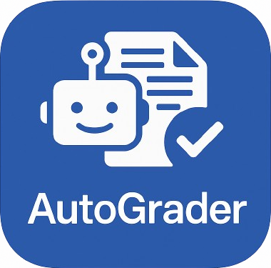
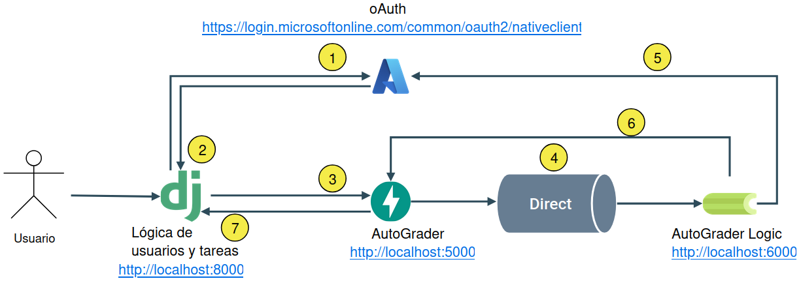

# Grading Essays with LLMs



## Índice

- [Descripción](#descripción)  
- [Características principales](#características-principales)  
- [Arquitectura](#arquitectura)  
- [Requisitos](#requisitos)  
- [Instalación](#instalación)  
- [Despliegue automático](#despliegue-automático)  
- [Uso](#uso)   

## Descripción

“Autograder” es una plataforma distribuida para la corrección automática de ejercicios de programación basada en grandes modelos de lenguaje (LLMs). Combina un frontend web en Django, un microservicio de evaluación en FastAPI, colas de Celery/Redis, entornos Docker para ejecución aislada y un sistema RAG (vector database, mediante chromadb) para recuperar ejemplos de código. Incluye estrategias de prompting (zero-shot, few-shot, chain-of-thought), ensemble voting y self-refinement, generando rúbricas parametrizadas para asegurar objetividad, trazabilidad y retroalimentación personalizada.

## Características principales

- Registro y autenticación de usuarios (OAuth2 Microsoft + credenciales propias)
- Gestión de ejercicios, rúbricas y tareas de evaluación
- Evaluación asíncrona con Celery y Redis
- Selección de modelo LLM (Groq, Gemini, Ollama, etc.)
- Estrategias de prompting: Zero-Shot, Few-Shot (RAG-powered), Chain-of-Thought
- Ensemble voting y self-refinement para mayor fiabilidad
- Ejecución sandbox en contenedores Docker
- Exportación de resultados en CSV
- Notificaciones automáticas de calificaciones por correo (Microsoft Graph API)

## Arquitectura


## Requisitos

- SO: Linux
- Python ≥ 3.10
- tmux (para deployment.sh)
- Redis (broker de Celery)
- Docker (para sandbox)
- Credenciales de Azure (Microsoft Graph API + OAuth2)

## Instalación

- Clona el repositorio:
```
git clone https://github.com/usuario/tfg-llm-autograder.git
cd tfg-llm-autograder
```
- Crea y activa un entorno virtual:
```
python3 -m venv venv
source venv/bin/activate
```

## Instala dependencias:
```
pip install -r requirements.txt
```
- Configura variables de entorno en config.ini (Azure, keys LLM, Redis URL, etc.)

## Despliegue automático

Para facilitar el arranque en desarrollo, el script deployment.sh crea una sesión de tmux con tres ventanas:
```
Django (puerto 8000)

FastAPI / Uvicorn (puerto 8001)

Celery Worker (cola evaluations)

chmod +x deployment.sh
./deployment.sh
```

El script:

- Inicia o reinicia la sesión tmux “tfg_services”
- Ventana 1: `python manage.py runserver localhost:8000`
- Ventana 2: `uvicorn main:app --reload --port 8001`
- Ventana 3: `celery -A worker worker --loglevel=info --queues=evaluations`

También, se ha implementado el despliegue de la herramienta de evaluación en un contenedor Docker.

## Uso

Accede a `http://localhost:8000` en tu navegador.

Regístrate o inicia sesión (OAuth2 Microsoft o usuario/contraseña).

Crea una tarea: sube un ZIP con ejercicios en C/Python, selecciona rúbrica y modelo LLM.

Consulta el estado en la interfaz; cuando termine, descarga el CSV y revisa la retroalimentación enviada por correo.
